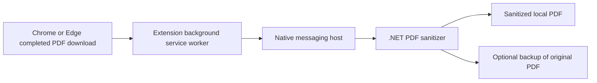

# local-pdf-sanitizer

## Overview
local-pdf-sanitizer is a Chromium extension plus a Windows .NET native messaging host that sanitizes downloaded PDFs locally. When a Chrome or Microsoft Edge download completes, the extension can hand the file path to a native host, which opens the PDF and removes clickable link annotations plus selected external or action-oriented PDF objects before replacing the local file.

This project is a local PDF risk-reduction utility. It is not antivirus, not a malware scanner, and not a sandbox.

## Why I Built This
Browsers and email workflows often move PDFs around quickly, but many teams still want a simple local control that reduces common click-through and action-based PDF risks before a user opens the file. local-pdf-sanitizer was built as a practical, transparent tool for that narrow job: reduce exposure to link-based and selected action-based PDF behaviors without uploading files to a cloud service.

## Features
- Monitors completed PDF downloads in Chrome and Edge.
- Uses native messaging to call a local Windows .NET sanitizer.
- Removes clickable link annotations from PDFs.
- Removes selected external or action-oriented PDF objects such as URI, launch, remote go-to, submit-form, import-data, and JavaScript actions.
- Optionally creates a local backup before replacing the file.
- Keeps processing local to the machine with no network upload path in the runtime flow.

## Architecture


High-level components:
- `extension/`: Manifest V3 extension that listens for completed downloads and sends PDF paths to the native host.
- `native-host/PdfSanitizerHost/`: .NET 8 native messaging host and PDF sanitizer implementation.
- `scripts/`: PowerShell scripts for build, install, uninstall, and release packaging.

Additional design notes are in [docs/architecture.md](docs/architecture.md).

## Security Model
- Files stay on the local machine. The project does not upload PDFs anywhere.
- The extension has no remote host permissions and only reacts to completed browser downloads.
- The browser extension does not execute local code directly; it communicates only through Chromium native messaging.
- The native host accepts structured messages on standard input and writes structured responses on standard output.
- Sanitization is focused on link annotations and selected external or action-oriented PDF objects. It does not attempt to fully decompile or emulate every PDF feature.

## What It Removes
The sanitizer currently targets:
- Clickable `/Link` annotations.
- Selected annotation actions under `/A` and `/AA` when they use `/URI`, `/Launch`, `/GoToR`, `/SubmitForm`, `/ImportData`, or `/JavaScript`.
- Document-level `/OpenAction`.
- Document-level `/AA`.
- Selected entries in the catalog `/Names` dictionary: `/JavaScript`, `/EmbeddedFiles`, and `/URLS`.

## What It Does Not Do
- It is not antivirus.
- It is not a malware scanner.
- It is not a sandbox.
- It does not inspect every malicious PDF behavior.
- It does not guarantee that every dangerous or malformed PDF is neutralized.
- It does not currently analyze embedded content beyond the specific objects it removes.
- It does not scan files downloaded outside the browser extension workflow.

## Installation
### Load the extension
1. Open `chrome://extensions` in Chrome or `edge://extensions` in Edge.
2. Enable **Developer mode**.
3. Click **Load unpacked**.
4. Select the `extension/` folder.
5. Copy the extension ID shown by the browser.

### Register the native host
The real native messaging manifest is generated by [scripts/install_native_host.ps1](scripts/install_native_host.ps1). Do not edit or commit `native-host/com.pdf_checker.sanitizer.json`.

Run:

```powershell
powershell -ExecutionPolicy Bypass -File .\scripts\install_native_host.ps1 -Browser Both -ExtensionId "CHROME_OR_EDGE_EXTENSION_ID"
```

If Chrome and Edge use different IDs for unpacked installs, pass both:

```powershell
powershell -ExecutionPolicy Bypass -File .\scripts\install_native_host.ps1 -Browser Both -ExtensionId "CHROME_ID","EDGE_ID"
```

The template file [native-host/com.pdf_checker.sanitizer.example.json](native-host/com.pdf_checker.sanitizer.example.json) is included only as a reference example.

## Build From Source
Prerequisites:
- Windows for native-host deployment and browser integration.
- .NET 8 SDK or newer to build the native host.

Build the native host:

```powershell
powershell -ExecutionPolicy Bypass -File .\scripts\build_native_host.ps1
```

For a follow-up offline publish after dependencies are already restored:

```powershell
powershell -ExecutionPolicy Bypass -File .\scripts\build_native_host.ps1 -NoRestore
```

The published executable is created under `native-host/publish/` and is intentionally ignored by Git.

## Chrome / Edge Native Messaging Setup
- Host name: `com.pdf_checker.sanitizer`
- Manifest file: generated at `native-host/com.pdf_checker.sanitizer.json`
- Allowed origins: one or more `chrome-extension://.../` IDs supplied to the install script
- Registry scope:
  - User scope writes to `HKCU\Software\Google\Chrome\NativeMessagingHosts\com.pdf_checker.sanitizer`
  - User scope writes to `HKCU\Software\Microsoft\Edge\NativeMessagingHosts\com.pdf_checker.sanitizer`
  - Machine scope writes to the corresponding `HKLM` locations

To remove only the browser registration:

```powershell
powershell -ExecutionPolicy Bypass -File .\scripts\uninstall_native_host.ps1 -Browser Both
```

## Active Directory / Enterprise Deployment Notes
- Use a stable extension ID instead of an unpacked development ID.
- Deploy the extension through Chrome or Edge enterprise policy.
- Deploy `PdfSanitizerHost.exe` to a fixed local path such as `C:\Program Files\PdfChecker\PdfSanitizerHost.exe`.
- Generate the manifest with the production extension ID and register it at machine scope.
- Verify policy application with `chrome://policy` or `edge://policy` on a client machine.

Example:

```powershell
powershell -ExecutionPolicy Bypass -File .\scripts\install_native_host.ps1 -Browser Both -ExtensionId "STABLE_EXTENSION_ID" -Scope Machine -SkipBuild
```

## Testing
The repository includes lightweight .NET tests for safe failure handling and native messaging behavior. They focus on logic that can be validated without maintaining complex binary PDF fixtures.

Run tests:

```powershell
dotnet test .\tests\PdfSanitizerHost.Tests\PdfSanitizerHost.Tests.csproj -c Release
```

Current tests cover:
- rejecting non-PDF paths;
- safe handling for missing files and directory paths;
- backup filename selection logic;
- native messaging EOF, incomplete header, oversize message, invalid JSON, and valid request parsing.

## Limitations
- The sanitizer intentionally targets a narrow subset of PDF behaviors.
- Password-protected or unsupported PDFs may fail to sanitize.
- A PDF can still be dangerous in ways this project does not detect or remove.
- The extension only acts after a browser download completes.
- The current automated tests do not yet include fixture-based end-to-end PDF samples.

## Roadmap
- Add fixture-based tests that validate real PDF transformations across multiple sample files.
- Add signed release packaging for easier enterprise deployment.
- Expand documentation for policy-based Chrome and Edge rollout.
- Evaluate broader PDF object coverage while keeping behavior deterministic and locally scoped.

## License
This project is released under the terms in [LICENSE](LICENSE).
